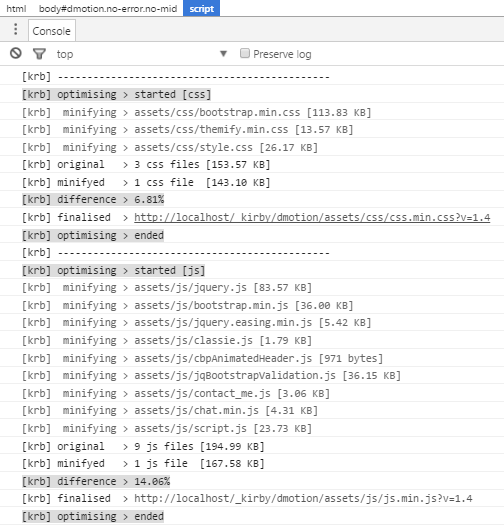

# [Kirby - KRB](https://github.com/1n3JgKl9pQ6cUMrW/kirby-krb)

#### Version 1.0.0 - 2016-07-08

- Initial Public Offering.

#### Version 1.1.0 - 2016-07-09

- Better debug options.
- Option to `defer` and `async` the minified js-output (`config.php`).

****

### What is it?

**[Kirby - KRB](https://github.com/1n3JgKl9pQ6cUMrW/kirby-krb)** minifies and combines all assets (both Javascript and Style Sheets) on the fly in one, compressed file.

It uses the **excellent** minifying library of **https://github.com/matthiasmullie/minify**

- Less **http-requests**, good for SEO performance.
- Less **bits and bytes** to download.
- **Version control**.
- Extended debugging options.
- Several MIME-types, one syntax.
- ...and more!

More info about Kirby can be found at **http://getkirby.com**

More info about this plug-in can be found at **https://forum.getkirby.com/t/4651/**

### Installation

- Download the .zip and extract it to the root of your site.
- Don't know which files? Just use `/site/plugins/krb/`.
- Optionally you can configure some settings in `site/config/config.php`.

### Usage

The `KRB` syntax looks like the default Kirby syntax when including assets, but's it has some differences;

```
  echo krb( array('assets/css/error.css',
                  'assets/css/main.css'),
            'css',
            1.2,
            true,
            true,
            true);
```

The `krb() function` takes these parameters;

- The assets to be minified / combined (array or singular).
- The file-type (css, or js).
- The version number (needed to force re-downloads of cached assets).
- Minify the assets, or not (defaults to Kirby standard way of including assets).
- Add cache-control to the query (`asset.mime?v=version-number`).
- Show debug-info in the console [F12].

The example above combines / minifies several CSS-assets, adds some cache-control to it and does show debug-info in the console.

```
  echo krb( 'assets/js/jquery.js',
            'js',
            1.4,
            false,
            true,
            true);
```

This example has only one file (`js type`) to include, version-control `1.4` attached to it and does not minify the (single) asset - while `version control` and `debugging` are active.

Wondering what all the shizzle is about? Turn on the debug-parameter, hit [F12] and you'll see the power of minifying and combining all your assets

### Config

By default, no `config` is needed. But you can set your preferences like the one below;

```
c::set('krb_html_min', false);
c::set('krb_css_path', 'assets/css/my_style.min.css');
c::set('krb_js_path', 'assets/js/my_script.min.js');
c::set('krb_js_async', false);
c::set('krb_js_defer', false);
```

- The first parameter also minifies your `html` output, which is cool - when your code is 100% correct (missing one semi-column ; can corrupt your scripts - so be careful when used).
- The next two parameters let you override the default minified / combined asset-path.
- The last two parameters let you set the `async` and `defer` option for the final, minified js-output.

###Important!###

- Like mentioned above, minifying does an excellent job with good codes; but when your (or a third-party) script is not 100% correct, it can be corrupted. Most of the time a semi-column ; is missing between the different functions.
- Also, turning on the cache or using plug-ins like **cachebuster** can "corrupt" the functionality of `KRB`.
- Be sure to test all, before combining / minifying / etc...

****



*KRB - real time minifying and combining of your assets, with debugging set in config.*